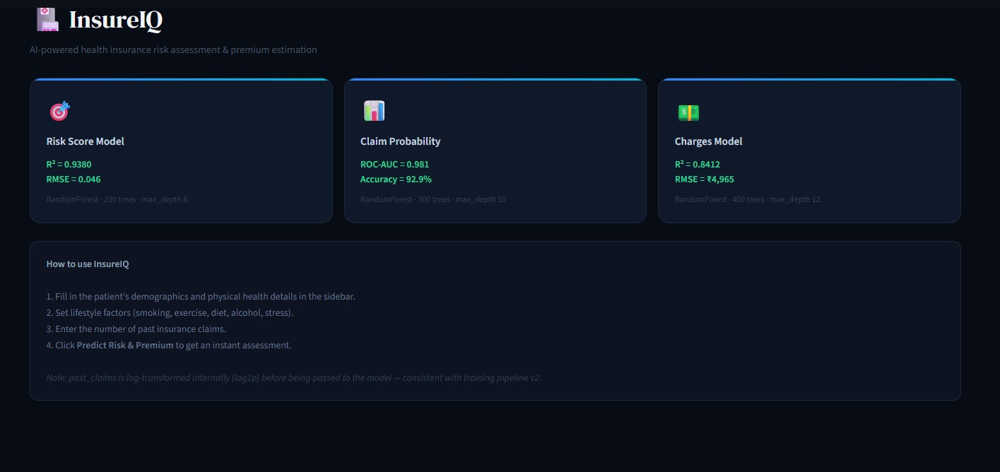
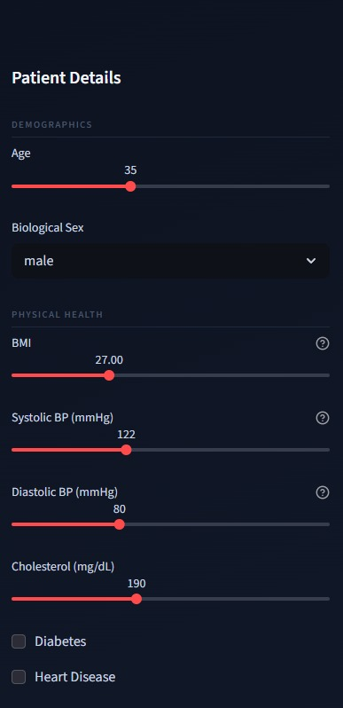
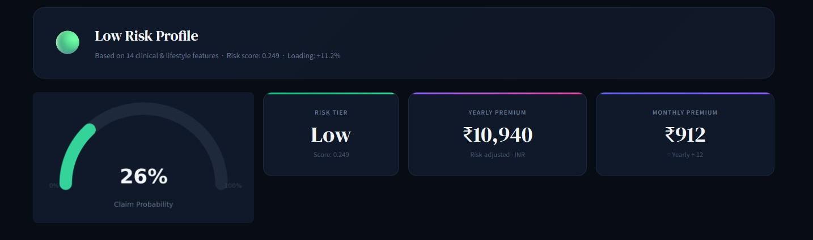
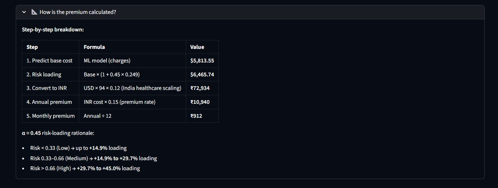

# Health Insurance ML Pipeline

## Files
| File | Purpose |
|------|---------|
| `insurance_pipeline.py` | Full ML training pipeline (run this first) |
| `app.py` | Streamlit UI app |
| `ml_dashboard.png` | Model evaluation dashboard |
| `insurance_extended_v2.csv` | Extended dataset (input) |

## Quick Start
```bash
# 1. Install dependencies
pip install scikit-learn pandas numpy matplotlib joblib streamlit

# 2. Train models (creates models/ folder)
python insurance_pipeline.py

# 3. Launch the UI
streamlit run app.py
```
## Screenshots

### Dashboard Overview


### Patient Details Input


### Risk Prediction Results


### Premium Calculation Breakdown



## Model Performance
| Model | Metric | Score |
|-------|--------|-------|
| Risk Score | R² | 0.9454 |
| Risk Score | RMSE | 0.0431 |
| Claim Probability | ROC-AUC | 0.9773 |
| Claim Probability | Accuracy | 90.7% |
| Charges | R² | 0.8667 |
| Charges | RMSE | $4,549 |

## Premium Formula
```
Adjusted Premium = Predicted Charges × (1 + 0.45 × risk_score)
```
α = 0.45 produces:
- Low risk  (<0.33) → up to +14.9% loading
- Medium    (0.33–0.66) → +14.9% to +29.7%
- High      (>0.66) → +29.7% to +45%
